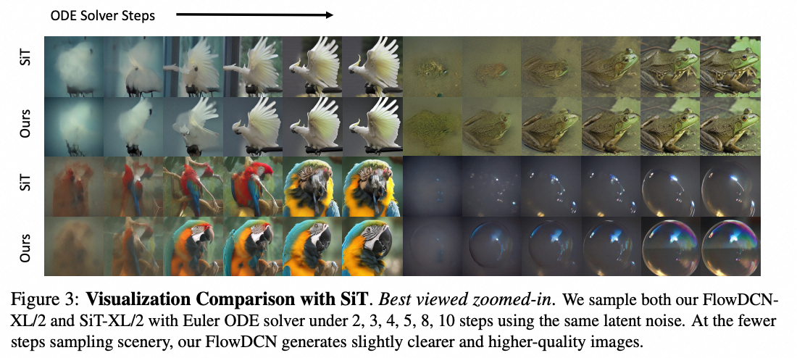

## [NeurIPS24] FlowDCN: Exploring DCN-like Architectures for Fast Image Generation with Arbitrary Resolution


### [NEWS] [9.26] 💐💐 Our FlowDCN is accepted by NeurIPS 2024! 💐💐
### [NEWS] [11.22] 🍺 Our FlowDCN model and code are now available in the official repo!

## Pretrained Models
Our Models consistently achieve state-of-the-art results on the sFID metrics compared to SiT/DiT.

### Metrics 
Our Models consistently has fewer parameters and GFLOPS compared to Transformer counterparts. 
Our code also support LogNorm and VAR(Various Aspect Ratio Training)

|    Model-iters     | Resolution |    Solver    | NFE-CFG | FID  | sFID | Params |Link|
|:------------------:|:----------:|:------------:|:-------:|:----:|:----:|:------:|:--:|
|   FlowDCN-S-400k   |  256x256   | EulerSDE-250 |  250x2  | 54.6 | 8.8  | 30.3M  |
|   FlowDCN-B-400k   |  256x256   | EulerSDE-250 |  250x2  | 28.5 | 6.09 |  120M  |
| VAR-FlowDCN-B-400k |  256x256   | EulerSDE-250 |  250x2  | 23.6 | 7.72 |  120M  |
|   FlowDCN-L-400k   |  256x256   | EulerSDE-250 |  250x2  | 13.8 | 4.69 |  421M  |
|   FlowDCN-XL-2M    |  256x256   | EulerODE-250 |  250x2  | 2.01 | 4.33 |  618M  |
|   FlowDCN-XL-2M    |  256x256   | EulerSDE-250 |  250x2  | 2.00 | 4.37 |  618M  |
|  FlowDCN-XL-100k   |  512x512   | EulerODE-50  |  50x2   | 2.76 | 5.29 |  618M  |
|  FlowDCN-XL-100k   |  512x512   | EulerSDE-250 |  250x2  | 2.44 | 4.53 |  618M  |

### Visualizations



[//]: # (### Various Resolution Extension)

[//]: # ()
[//]: # (![caps]&#40;./figs/var_fid.png&#41;)

## Linear-Multi-step Solvers and NeuralSolvers
We also provide a adams-like linear-multi-step solver for the recitified flow sampling. The related configs are named with `adam2` or `adam4`. The solver code are placed in `./src/diffusion/flow_matching/adam_sampling.py`.

Compared to Henu/RK4, the linear-multi-step solver is more stable and faster.

During some experiments, we supringly find that the linear-multi-step solver can achieve comparable results even with FlowTurbo.

As they are distinct methods, so armed with Adams, we believe FlowTurbo can be more powerful.

Also, We provide some magic solvers for the recitified flow sampling. These solvers are highly inspired by linear-multi-steps methods, and consists of just some **Magic Numbers**
These solvers are really powerful and interesting. We place the related code in `./src/diffusion/flow_matching/ns_sampling.py`.

| SiT-XL-R256 | Steps | NFE-CFG  | Extra-Paramters | FID  | IS    | PR   | Recall |
|--|-------|----------|-----------------|------|-------|------|--------|
| Heun | 8     | 16x2     | 0               | 3.68 | /     | /    | /      |
| Heun | 11    | 22x2     | 0               | 2.79 | /     | /    | /      |
| Heun | 15    | 30x2     | 0               | 2.42 | /     | /    | /      |
| Adam2 | 6     | 6x2      | 0 | 6.35 | 190   | 0.75 | 0.55   |
| Adam2 | 8     | 8x2      | 0 | 4.16 | 212   | 0.78 | 0.56   |
| Adam2 | 16    | 16x2     | 0 | 2.42 | 237   | 0.80 | 0.60   |
| Adam4 | 16    | 16x2     | 0 | 2.27 | 243   | 0.80 | 0.60   |
| FlowTurbo | 6     | (7+3)x2  | 30408704(29M)   | 3.93 | 223.6 | 0.79 | 0.56   |
| FlowTurbo | 8     | (8+2)x2  | 30408704(29M)   | 3.63 | /     | /    | /      |
| FlowTurbo | 10    | (12+2)x2 | 30408704(29M)   | 2.69 | /     | /    | /      |
| FlowTurbo | 15    | (17+3)x2 | 30408704(29M)   | 2.22 | 248   | 0.81 | 0.60   |
| NeuralSolver | 6     | 6x2      | 21              | 3.57 | 214   | 0.77 | 0.58   |
| NeuralSolver | 7     | 7x2      | 28              | 2.78 | 229   | 0.79 | 0.60   |
| NeuralSolver | 8     | 8x2      | 36              | 2.65 | 234   | 0.79 | 0.60   |
| NeuralSolver | 10    | 10x2     | 55              | 2.40 | 238   | 0.79 | 0.60   |
| NeuralSolver | 15    | 15x2     | 110              | 2.24 | 244   | 0.80 | 0.60   |

## Citation
```bibtex
@inproceedings{
wang2024exploring,
title={Exploring {DCN}-like architecture for fast image generation with arbitrary resolution},
author={Shuai Wang and Zexian Li and Tianhui Song and Xubin Li and Tiezheng Ge and Bo Zheng and Limin Wang},
booktitle={The Thirty-eighth Annual Conference on Neural Information Processing Systems},
year={2024},
url={https://openreview.net/forum?id=e57B7BfA2B}
}
```


